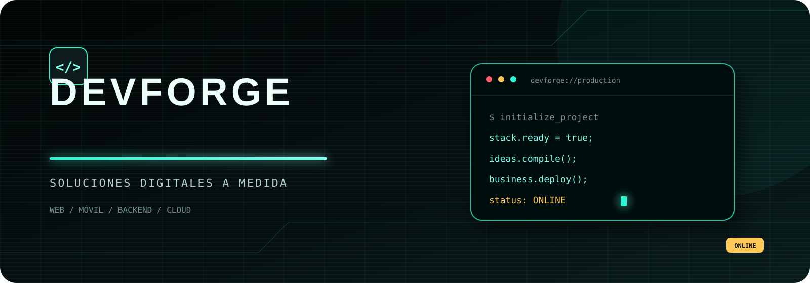

<div align="center">
  
</div>

# DevForge

Landing page estática y demostrativa para presentar servicios de desarrollo web, móvil, backend y cloud. Su interfaz combina estética oscura neón/hacker, navegación por secciones y diseño adaptable a distintos tamaños de pantalla.

## Características

- Hero con propuesta de valor y acceso directo a catálogo y contacto.
- Catálogo de productos y servicios digitales.
- Especificaciones técnicas, promociones y categorías.
- Indicadores mediante elementos nativos `progress` y `meter`.
- Tabla comparativa de planes de garantía.
- Formulario con validación nativa de campos requeridos y correo electrónico.
- Diseño responsive con estados de foco y soporte para movimiento reducido.

## Ejecución local

No requiere instalación, dependencias ni proceso de compilación.

1. Abre `index.html` directamente en el navegador.
2. Como alternativa, sirve la carpeta con un servidor estático local.

## Estructura

```text
.
|-- assets/
|   `-- readme-banner.svg
|-- README.md
|-- index.html
`-- styles.css
```

`index.html` contiene todo el contenido y `styles.css` define el diseño y los ajustes responsive. No hay JavaScript, framework ni proceso de compilación.

## Alcance funcional

El formulario aplica validación nativa del navegador, pero su acción apunta a `#`: no procesa ni guarda datos. No existe backend ni persistencia.

## Tecnologías

- HTML5 semántico
- CSS3
- Google Fonts: Orbitron, Exo 2 y JetBrains Mono
